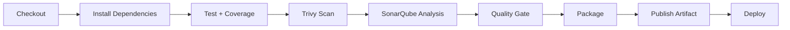

<div align="center">

# 📝 ifs24024-pabwe2026-nextjs

**Aplikasi Postingan berbasis Next.js (TypeScript) dengan Redux Toolkit, Tailwind CSS v4, dan CI/CD otomatis**


</div>

---

## 📑 Daftar Isi

- [Tentang Proyek](#-tentang-proyek)
- [Fitur Utama](#-fitur-utama)
- [Teknologi](#-teknologi)
- [Struktur Proyek](#-struktur-proyek)
- [Rute Aplikasi](#-rute-aplikasi)
- [Memulai](#-memulai)
- [Konfigurasi Lingkungan](#-konfigurasi-lingkungan)
- [Pengujian](#-pengujian)
- [CI/CD Pipeline](#-cicd-pipeline)
- [Referensi API](#-referensi-api)

---

## 📖 Tentang Proyek

Aplikasi ini adalah platform linimasa postingan sosial yang mengonsumsi **Delcom Open API** sebagai sumber data. Pengguna dapat mendaftar, masuk, membuat postingan dengan gambar cover, memberi *like*, berkomentar, serta mengelola profil mereka.

Proyek dibangun dengan arsitektur **berbasis fitur (feature-based)**, state management terpusat menggunakan **Redux Toolkit**, serta standar kualitas tinggi: **cakupan pengujian 100%**, analisis statis **SonarQube**, pemindaian keamanan **Trivy**, dan deployment otomatis melalui **Jenkins**.

---

## ✨ Fitur Utama

### 🔐 Autentikasi
- Registrasi dan login pengguna dengan validasi formulir
- Penyimpanan token akses di `localStorage` dan bearer token otomatis pada setiap request
- Proteksi rute: pengguna yang sudah login dialihkan dari halaman auth ke dashboard

### 📰 Manajemen Postingan
- Linimasa postingan publik dengan tab filter **Postingan Saya** (`is_me=1`)
- Pencarian langsung (*live search*)
- Tambah, ubah, dan hapus postingan
- Unggah atau ganti gambar cover dengan pratinjau (*preview*)
- Like / unlike postingan
- Tambah dan hapus komentar
- Hapus seluruh postingan milik pengguna

### 👤 Pengguna & Profil
- Direktori seluruh pengguna dengan fitur pencarian
- Pembaruan profil (bio), foto avatar, dan kata sandi

### 🎨 Antarmuka
- Desain responsif dengan sidebar berbentuk *drawer* di perangkat mobile
- Dialog interaktif menggunakan SweetAlert2
- Tipografi menggunakan Google Fonts

---

## 🛠 Teknologi

| Kategori | Teknologi |
| --- | --- |
| Runtime & Package Manager | [Bun](https://bun.sh) |
| Framework | [Next.js](https://nextjs.org) (App Router, Turbopack) |
| Bahasa | TypeScript |
| Styling | Tailwind CSS v4 (`@tailwindcss/postcss`) |
| Ikon | `react-icons` / `tabler-icons` |
| State Management | Redux Toolkit, React-Redux |
| Notifikasi / Dialog | SweetAlert2 |
| Testing | Vitest, jsdom, Testing Library, `@vitest/coverage-v8` |
| Kualitas Kode | ESLint, SonarQube |
| Keamanan | Trivy |
| CI/CD | Jenkins + Docker |

---

## 🗂 Struktur Proyek

```text
ifs24024-pabwe2026-nextjs/
├── src/
│   ├── app/                          # Next.js App Router
│   │   ├── layout.tsx                # Root layout (font, globals.css, Providers)
│   │   ├── globals.css               # Konfigurasi Tailwind CSS v4
│   │   ├── auth/
│   │   │   ├── layout.tsx            # Membungkus AuthLayout
│   │   │   ├── login/page.tsx
│   │   │   └── register/page.tsx
│   │   └── (dashboard)/
│   │       ├── layout.tsx            # Membungkus PostLayout (route guard)
│   │       ├── page.tsx              # HomePage
│   │       ├── posts/[postId]/page.tsx
│   │       ├── users/page.tsx
│   │       └── profile/page.tsx
│   │
│   ├── features/
│   │   ├── auth/                     # api, states, layouts, pages
│   │   ├── users/                    # api, states, pages
│   │   └── posts/                    # api, states, layouts, components, modals, pages
│   │
│   ├── components/
│   │   └── Providers.tsx             # Redux <Provider>
│   ├── helpers/
│   │   ├── apiHelper.ts              # Wrapper fetch + manajemen token
│   │   └── toolsHelper.ts            # Dialog SweetAlert2 + formatDate
│   ├── hooks/
│   │   ├── useInput.ts               # Hook two-way binding formulir
│   │   └── redux.ts                  # useAppDispatch & useAppSelector
│   ├── lib/
│   │   └── config.ts                 # Konstanta konfigurasi terpusat
│   ├── types/
│   │   ├── action.ts                 # Tipe payload action
│   │   └── index.ts                  # Post, PostAuthor, PostComment, User, ApiResult
│   ├── store.ts                      # Konfigurasi Redux store
│   ├── server.ts                     # Launcher server (membaca APP_PORT)
│   ├── setupTests.ts                 # Setup Vitest + jest-dom
│   └── test-utils.tsx                # renderWithProviders
│
├── .env.example
├── Jenkinsfile                       # Definisi pipeline CI/CD
├── next.config.ts
├── sonar-project.properties
└── vitest.config.mts
```

---

## 🧭 Rute Aplikasi

| Rute | Halaman | Akses |
| --- | --- | --- |
| `/auth/login` | Login | Publik |
| `/auth/register` | Registrasi | Publik |
| `/` | Linimasa postingan | 🔒 Terproteksi |
| `/posts/[postId]` | Detail postingan | 🔒 Terproteksi |
| `/users` | Daftar pengguna | 🔒 Terproteksi |
| `/profile` | Profil saya | 🔒 Terproteksi |

---

## 🚀 Memulai

### Prasyarat

- [Bun](https://bun.sh) terbaru
- Node.js 24 atau lebih baru (digunakan oleh test runner di pipeline)
- Git

### Instalasi

```bash
# 1. Clone repository
git clone <url-repository> ifs24024-pabwe2026-nextjs
cd ifs24024-pabwe2026-nextjs

# 2. Pasang dependensi
bun install

# 3. Siapkan environment
cp .env.example .env
```

### Menjalankan Aplikasi

```bash
# Mode pengembangan
bun run dev

# Build produksi
bun run build

# Jalankan hasil build
bun run start
```

Aplikasi berjalan pada port yang ditentukan oleh variabel `APP_PORT`.

---

## ⚙️ Konfigurasi Lingkungan

Salin `.env.example` menjadi `.env`, lalu sesuaikan nilainya:

```env
NEXT_PUBLIC_DELCOM_BASEURL=https://open-api.delcom.org/api/v1
APP_PORT=3000
```

| Variabel | Deskripsi |
| --- | --- |
| `NEXT_PUBLIC_DELCOM_BASEURL` | Base URL Delcom Open API |
| `APP_PORT` | Port server aplikasi (dibaca oleh `src/server.ts`) |

> 💡 Nilai dibaca secara terpusat melalui `src/lib/config.ts`.

---

## 🧪 Pengujian

Proyek menggunakan **Vitest** dengan lingkungan **jsdom** dan pelaporan cakupan kode berbasis **v8** dengan ambang batas minimum **100%**.

```bash
# Jalankan seluruh pengujian
bun run test

# Jalankan dengan laporan coverage
npx vitest run --coverage
```

Laporan coverage tersedia di direktori `coverage/` (termasuk `lcov.info` yang dibaca oleh SonarQube).

### Cakupan Pengujian

| Modul | Berkas Pengujian |
| --- | --- |
| **Helper & Hooks** | `apiHelper.test.ts`, `toolsHelper.test.ts`, `useInput.test.ts` |
| **Auth** | `authApi.test.ts`, `action.test.ts`, `reducer.test.ts`, `AuthLayout.test.tsx`, `LoginPage.test.tsx`, `RegisterPage.test.tsx` |
| **Posts** | `postApi.test.ts`, `action.test.ts`, `reducer.test.ts`, `NavbarComponent.test.tsx`, `SidebarComponent.test.tsx`, `AddModal.test.tsx`, `ChangeModal.test.tsx`, `ChangeCoverModal.test.tsx`, `PostLayout.test.tsx`, `HomePage.test.tsx`, `DetailPage.test.tsx` |
| **Users** | `userApi.test.ts`, `action.test.ts`, `reducer.test.ts`, `UsersPage.test.tsx`, `ProfilePage.test.tsx` |
| **Store** | `store.test.ts` |

---

## 🔄 CI/CD Pipeline

Pipeline didefinisikan pada `Jenkinsfile` dan setiap stage dijalankan di dalam container Docker yang terisolasi.



### Tahapan Pipeline

| # | Stage | Image | Deskripsi |
| --- | --- | --- | --- |
| 1 | **Checkout** | `oven/bun:alpine` | Mengambil kode sumber dari SCM |
| 2 | **Install Dependencies** | `oven/bun:alpine` | Menjalankan `bun install` |
| 3 | **Test** | `node:24-alpine` | Menjalankan `vitest run --coverage` |
| 4 | **Trivy Security Scan** | `aquasec/trivy` | Memindai kerentanan `HIGH`/`CRITICAL`; hasil SARIF dilaporkan ke Warnings NG, build gagal bila ditemukan |
| 5 | **SonarQube Analysis** | `sonarsource/sonar-scanner-cli` | Analisis kualitas kode dan coverage |
| 6 | **Quality Gate** | — | Menunggu hasil Quality Gate (timeout 30 menit), pipeline dihentikan bila gagal |
| 7 | **Package Application** | `node:24-alpine` | Membuat `latest-app.zip` (mengecualikan `node_modules`, `.env`, `.next`, `coverage`, dll.) |
| 8 | **Publish Application** | — | Mengarsipkan artifact dan menyalinnya ke Jenkins `userContent` untuk mendapatkan URL publik |
| 9 | **Deploy Application** | `curlimages/curl` | Memicu redeploy melalui API, lalu polling status hingga `SUCCESS` atau `FAIL` (maks. 120 percobaan × 5 detik) |

### Konfigurasi SonarQube

Berkas `sonar-project.properties`:

```ini
sonar.projectKey=ifs24024-pabwe2026-nextjs
sonar.projectName=ifs24024-pabwe2026-nextjs

sonar.sources=src
sonar.tests=src
sonar.test.inclusions=**/*.test.ts,**/*.test.tsx,**/*.test.js,**/*.test.jsx

sonar.sourceEncoding=UTF-8

sonar.javascript.lcov.reportPaths=coverage/lcov.info

sonar.exclusions=node_modules/**,coverage/**,.next/**,dist/**,src/setupTests.ts,src/test-utils.tsx,**/*.test.ts,**/*.test.tsx,**/*.test.js,**/*.test.jsx
```

### Variabel Lingkungan Jenkins

Pastikan variabel berikut tersedia pada job Jenkins (sebagai environment atau credentials):

| Variabel | Fungsi |
| --- | --- |
| `URL_REDEPLOY` | Endpoint untuk memicu redeploy |
| `URL_PROGRESS` | Endpoint untuk memeriksa progres deployment |
| `DEPLOY_TOKEN` | Token akses deployment |
| `WEBSITE_ID` | ID website target deployment |

Prasyarat tambahan:

- Server SonarQube terdaftar di Jenkins dengan nama **`SonarQube`**
- Jenkins dan SonarQube berada pada Docker network **`cicd-network`**
- Container Jenkins bernama **`cicd-jenkins`** dan Docker socket dapat diakses oleh agent
- Plugin Jenkins: Docker Pipeline, SonarQube Scanner, Warnings Next Generation, Pipeline Utility Steps

---

## 🌐 Referensi API

Sumber data: [Delcom Open API – Posts](https://open-api.delcom.org/docs/1.0/api-posts)

<details>
<summary><b>Autentikasi</b></summary>

| Method | Endpoint | Deskripsi |
| --- | --- | --- |
| `POST` | `/auth/register` | Registrasi akun baru |
| `POST` | `/auth/login` | Login pengguna |

</details>

<details>
<summary><b>Pengguna</b></summary>

| Method | Endpoint | Deskripsi |
| --- | --- | --- |
| `GET` | `/users` | Daftar pengguna |
| `GET` | `/users/me` | Profil pengguna aktif |
| `PUT` | `/users/me` | Perbarui profil |
| `POST` | `/users/me/photo` | Unggah foto avatar |
| `PUT` | `/users/me/password` | Ubah kata sandi |

</details>

<details>
<summary><b>Postingan</b></summary>

| Method | Endpoint | Deskripsi |
| --- | --- | --- |
| `GET` | `/posts` | Daftar postingan (`is_me=1` untuk milik sendiri) |
| `GET` | `/posts/:id` | Detail postingan |
| `POST` | `/posts` | Tambah postingan |
| `PUT` | `/posts/:id` | Ubah deskripsi postingan |
| `POST` | `/posts/:id/cover` | Unggah / ganti cover |
| `DELETE` | `/posts/:id` | Hapus postingan |
| `DELETE` | `/posts` | Hapus seluruh postingan milik pengguna |
| `POST` | `/posts/:id/likes` | Like / unlike |
| `POST` | `/posts/:id/comments` | Tambah komentar |
| `DELETE` | `/posts/:id/comments` | Hapus komentar |

</details>

---

<div align="center">

Dibuat untuk mata kuliah **Pengembangan Aplikasi Web Lanjut (PABWE) 2026**
**ifs24024**

</div>
